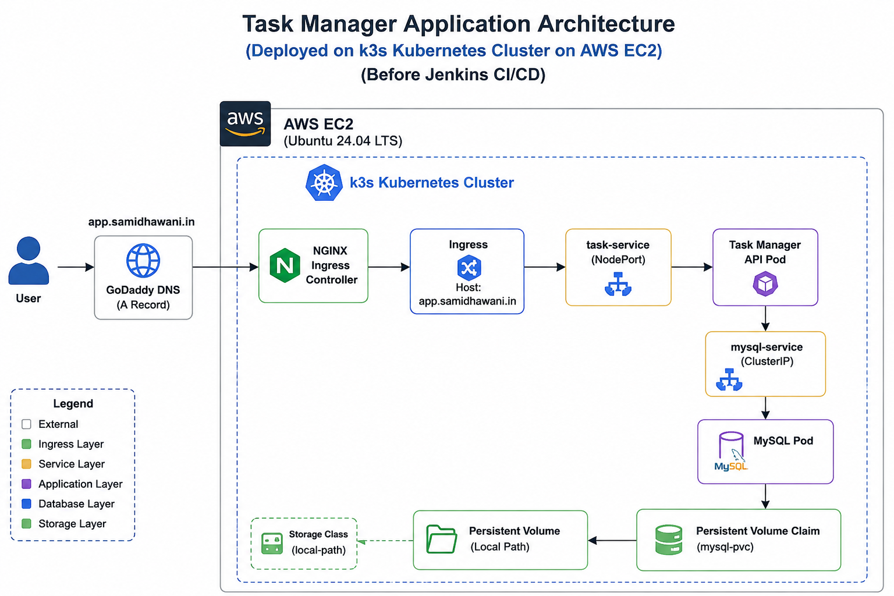
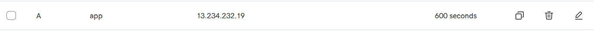
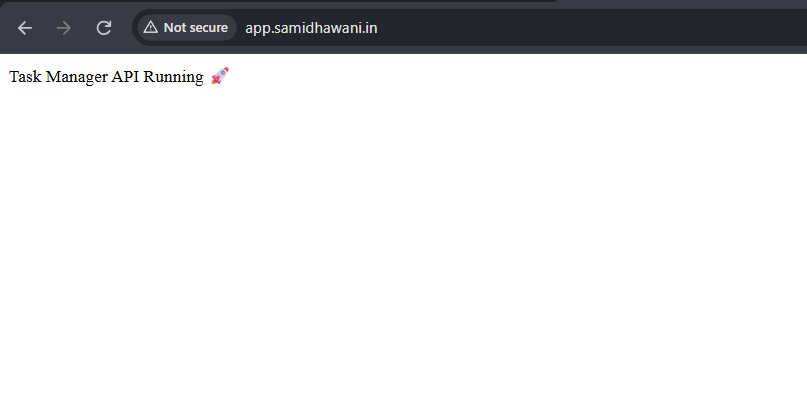
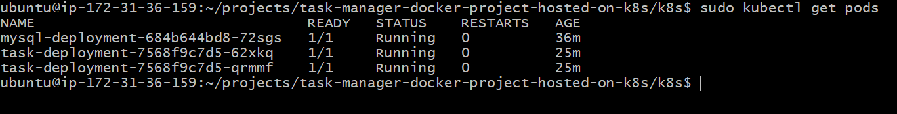
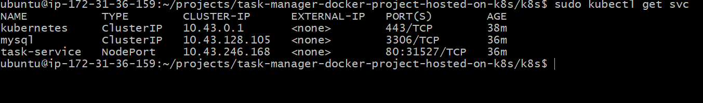
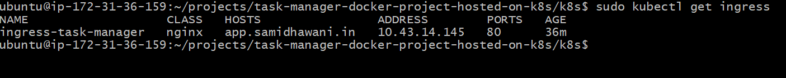

# 🚀 Task Manager API on AWS EC2 using k3s Kubernetes
A containerized **Task Manager REST API** deployed on an **AWS EC2** instance using **k3s Kubernetes**. The application is exposed using the **NGINX Ingress Controller** and is accessible through a custom domain.

---

## 🏗️ Architecture



---

## 🌐 Domain Name 

http://app.samidhawani.in

---

## 📸 Domain Mapping



---

## 🛠️ Tech Stack

- AWS EC2
- Ubuntu
- Docker
- Docker Hub
- Kubernetes (k3s)
- NGINX Ingress Controller
- MySQL
- ConfigMaps
- Secrets
- Persistent Volume Claim (PVC)

---
## 📸 Application



## 📸 Deployment Screenshots

### Kubernetes Pods



### Kubernetes Services



### Kubernetes Ingress



---

# ✨ Features

- REST API for Task Management
- Dockerized Application
- Kubernetes Deployment
- MySQL Database
- NGINX Ingress Controller
- Custom Domain Configuration
- Kubernetes ConfigMaps & Secrets
- Persistent Storage for Database

---

# 📂 Project Structure

```text
task-manager-docker-project/
│
├── app/
├── Dockerfile
├── requirements.txt
├── README.md
│
└── k8s/
    ├── configmap.yaml
    ├── secret.yaml
    ├── pvc.yaml
    ├── mysql-deployment.yaml
    ├── mysql-service.yaml
    ├── task-deployment.yaml
    ├── task-service.yaml
    └── ingress.yaml
```

---

# 🚀 Deployment Steps

Clone the repository

```bash
git clone https://github.com/<your-username>/<repository-name>.git
cd <repository-name>/k8s
```

Deploy Kubernetes resources

```bash
kubectl apply -f secret.yaml
kubectl apply -f configmap.yaml
kubectl apply -f pvc.yaml
kubectl apply -f mysql-deployment.yaml
kubectl apply -f mysql-service.yaml
kubectl apply -f task-deployment.yaml
kubectl apply -f task-service.yaml
kubectl apply -f ingress.yaml
```

Verify deployment

```bash
kubectl get pods
kubectl get svc
kubectl get ingress
```

---

# 🌍 Domain Configuration

Configured a custom domain using **GoDaddy DNS**.

```
app.samidhawani.in
        │
        ▼
AWS EC2 Public IP
        │
        ▼
NGINX Ingress Controller
        │
        ▼
Task Manager API
```

---

# 🔧 Challenges Solved

- Configured custom domain with GoDaddy.
- Deployed application on a single-node Kubernetes cluster using **k3s**.
- Replaced the default **Traefik Ingress Controller** with the **NGINX Ingress Controller**.
- Configured **hostNetwork** for direct access on ports **80** and **443**.
- Troubleshot Kubernetes networking and Ingress routing.
- Verified Kubernetes Deployments, Services, Pods, and Ingress resources.
- Successfully exposed the application using a custom domain.

---

# 🚀 Future Improvements

- Jenkins CI/CD Pipeline
- HTTPS using Cert-Manager & Let's Encrypt
- Helm Chart
- Monitoring with Prometheus & Grafana
- Deploy on Amazon EKS
- Horizontal Pod Autoscaler (HPA)

---

# 📚 Skills Demonstrated

- AWS EC2
- Linux Administration
- Docker
- Docker Hub
- Kubernetes (k3s)
- NGINX Ingress Controller
- Kubernetes Deployments
- Kubernetes Services
- Kubernetes Ingress
- ConfigMaps
- Secrets
- Persistent Storage
- DNS Configuration
- Kubernetes Troubleshooting

---

# 👩‍💻 Author

**Samidha Wani**

GitHub: https://github.com/samidha1-1

LinkedIn: *https://www.linkedin.com/in/samidha-wani-411549285/*
